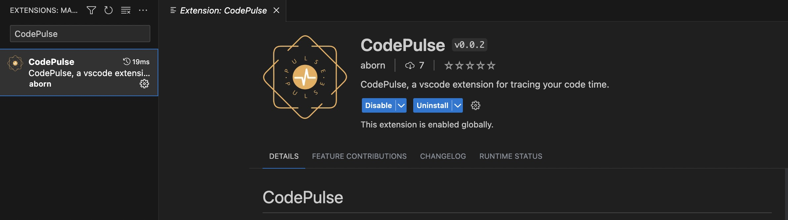
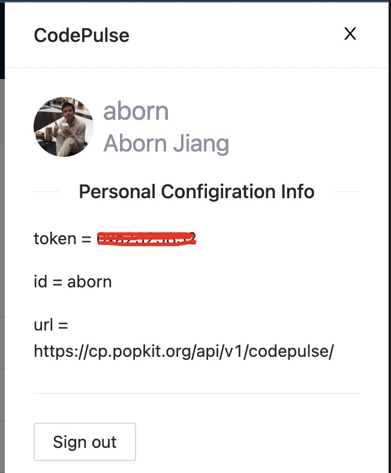
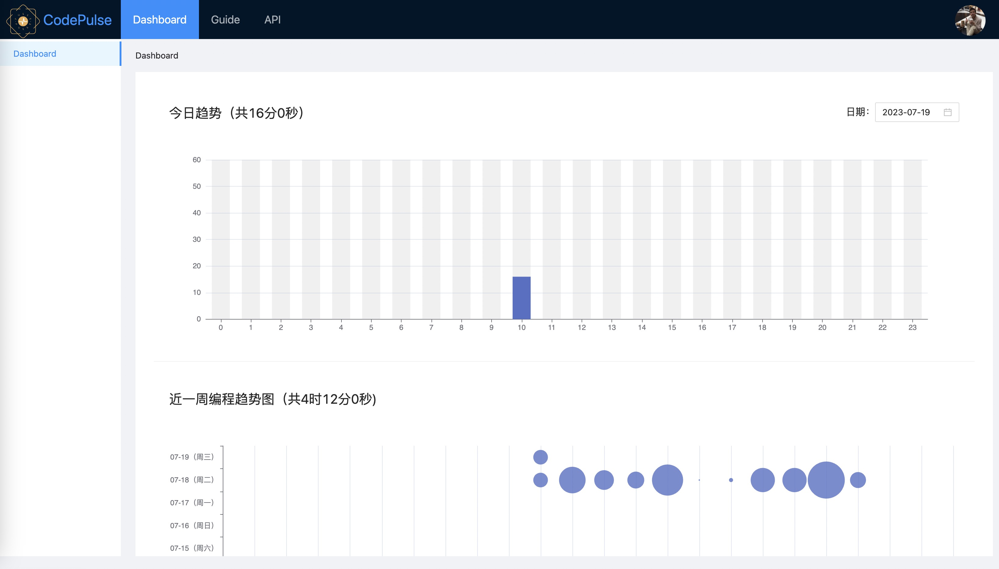

# CodePulse
 码脉，编程足迹追踪。

## 源代码
### plugins
**codepulse-idea** 为 Intellij IDEA 插件的源代码。  
**codepulse-vscode** 为 VS Code 插件的源代码。  

### webapp
**codepulse-serv** Java后端实现数据存储的API  
**codepulse-vue** 码脉的管理后台，大图展示等  

## 如何使用

1. 安装插件
以VSCode为例，在插件市场搜索 **CodePulse** ，然后安装，如下图：  
  

**注意** ：如果没有插件市场找到，可在项目的 plugins 目录下载文件，进行本地安装。

2. 配置插件
打开 [CodePulse](https://cp.popkit.org/#/) 站点，点击右上角使用Github账号授权登录。    
登录完成后点击用户头像获得用户上报的token信息及上报连接信息，如下图：  
    
将这些信息配置在自己的 *~/.codepulse.cfg* 这个文件里，如下内容：  
```
token = 0xaxxxeeei
url = https://cp.popkit.org/api/v1/codepulse/
id = aborn
```

3. 上报的显示大图，如下  


